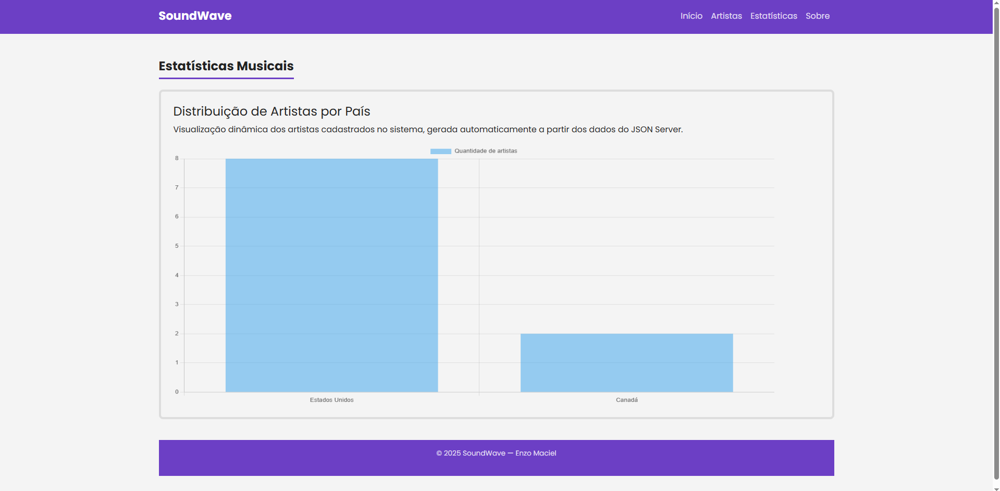
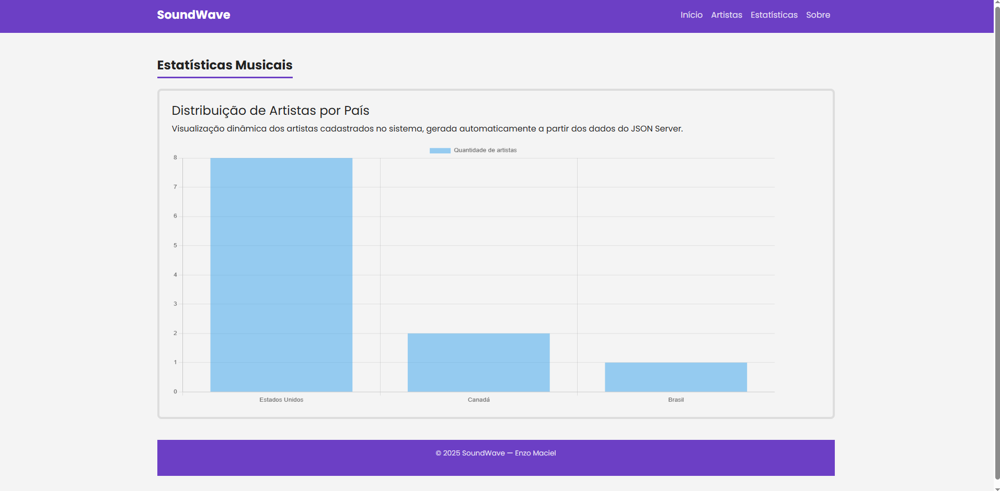

# SoundWave

## Aluno

Nome: Enzo Maciel

Matrícula: 911688

---

## Sobre o projeto

O SoundWave é um site sobre artistas musicais. O usuário pode visualizar os artistas cadastrados, acessar uma página com mais informações e ver algumas músicas relacionadas a cada artista.

O projeto foi desenvolvido utilizando HTML, CSS, JavaScript, Bootstrap e JSON Server.

---

## Estrutura do banco de dados

O arquivo `db.json` possui 3 coleções:

### artistas

Guarda as informações dos artistas.

Exemplos de dados:

- id
- nome
- descrição
- gênero
- país
- imagem
- destaque

### musicas

Guarda as músicas de cada artista.

Exemplos de dados:

- id
- artistaId
- nome
- descrição
- imagem

### categorias

Guarda os gêneros musicais utilizados no projeto.

Exemplos:

- Pop
- Hip-Hop
- Rap
- R&B
- Trap

---

## Exemplo de artista

```json
{
  "id": 1,
  "nome": "Michael Jackson",
  "genero": "Pop / R&B",
  "pais": "Estados Unidos",
  "destaque": true
}
```

---

## Funcionalidades

- Listagem de artistas na página inicial
- Carrossel com artistas em destaque
- Página de detalhes para cada artista
- Exibição das músicas relacionadas ao artista
- Busca dos dados através do JSON Server
- Uso de URLSearchParams para obter o id da URL

---
## Estatísticas Musicais

Foi desenvolvida uma página de estatísticas utilizando a biblioteca Chart.js.

A funcionalidade realiza a leitura dos dados armazenados no JSON Server e gera automaticamente um gráfico de barras apresentando a quantidade de artistas cadastrados por país.

A visualização é atualizada dinamicamente sempre que os dados são alterados por meio das operações de CRUD.

### Demonstração

#### Print 1 - Dados Originais



Gráfico gerado a partir dos dados originais cadastrados no sistema.

#### Print 2 - Dados Após Alteração



Gráfico atualizado após a inclusão de novos dados no JSON Server, demonstrando o comportamento dinâmico da aplicação.

## Como executar

Instalar as dependências:

```bash
npm install
```

Executar o JSON Server:

```bash
node ./node_modules/json-server/lib/cli/bin.js --watch ./db/db.json --static ./public
```

Abrir no navegador:

```text
http://localhost:3000
```

---

## Imagens

### Página Inicial

Adicionar print da Home.


### Página de Detalhes

Adicionar print da página de detalhes.


---

## Tecnologias utilizadas

- HTML
- CSS
- JavaScript
- Bootstrap
- JSON Server
- Fetch API

---

Trabalho desenvolvido para a disciplina de Desenvolvimento de Interfaces Web.
